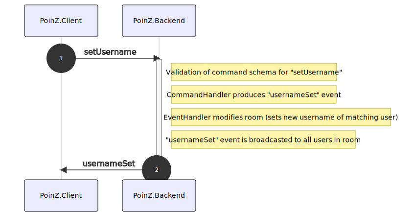

# PoinZ technical documentation

This page provides information about building and developing PoinZ, as well as its architecture.

Checkout the [user manual](./manual.md), if you need help with PoinZ features and use cases...

## Development

### Prerequisites

* Install `nodeJS` at v14+ and `npm` at v6+.
* Install git
* Install `docker` if you want to build PoinZ

Fork & checkout the repository then install all npm dependencies.

`$ npm install`  (This will also install *client* and *server* npm dependencies)

Start the backend

`$ cd server/ && npm run start:dev`

Serve the client in dev mode via webpack-dev-server

`$ cd client/ && npm start`

Then you can open the app at http://localhost:9000/

#### Style

Run ```$ npm t``` in the root directory to lint all files and run tests.

#### Build

Our build produces a docker image that contains nodejs and our poinz server.
Make sure you have docker installed on your machine and your user is in the "docker" usergroup. (```$ sudo groupadd docker``` and ```$ sudo usermod -aG docker $USER```)

In project root, run

```
$ npm run build
```

This will copy all backend and client files to `deploy/`.
And then start the docker build.

See [Deployment](docu/deployment.md) for more information.

To start the newly built image locally, in detached mode with port forwarding:
```
$ docker run -p 3000:3000 -d xeronimus/poinz
```

## Architecture

### Technologies and Frameworks

The PoinZ Client is built with [ReactJS](https://facebook.github.io/react/) and [redux](https://github.com/reactjs/redux).
[Webpack](https://webpack.github.io/) serves as bundling tool.

The PoinZ Backend is a nodeJS [express](http://expressjs.com/) server.

Client and server communicate mostly over websockets ([socket.io](https://socket.io/)). The Backend provides a few REST endpoints as well.

### Command and Events documentation

Our backend handles commands sent by the client over a websocket connection.
Every command produces one or multiple events that modify the respective room (aka "aggregate").
Then the events are sent back to the client. (This is somewhat inspired by [CQRS](https://martinfowler.com/bliki/CQRS.html).)

The following diagram shows the basic attributes of every command and event:


Simple sequence diagram that shows the basic flow and command handling:


Example with a simple command that produces just one event:



For a list of all the commands and their respective events, see the generated [command and event docu](/docu/commandAndEventDocu.md);


